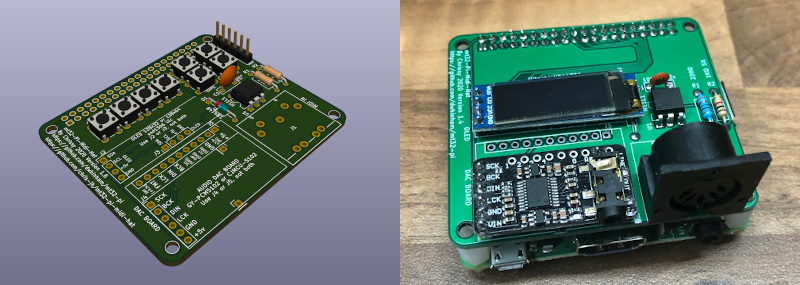
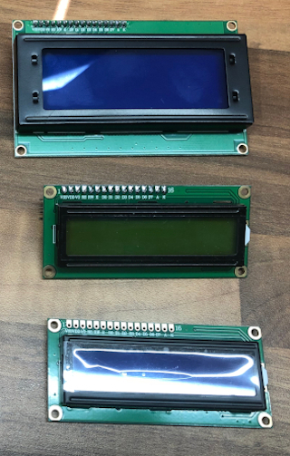
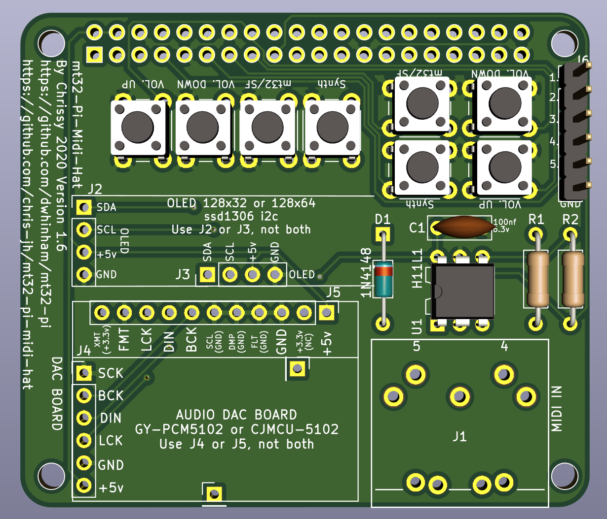

# mt32-pi-midi-hat
A Raspberry Pi Midi Hat for the project mt32-pi by Dale Whinham (https://github.com/dwhinham/mt32-pi).

This PCB is designed from the schematic available from the above project.

The Gerbers have been created from the recommendations at JLCPCB.

(https://support.jlcpcb.com/article/102-kicad-515---generating-gerber-and-drill-files)

You may need to re-generate for your chosen PCB Manufacturer

Version 1.7.2 Copyright 2021 Chrissy

* Moved a trace that was too close to the mounting screw hole. Could cause a short is over tighten to expose the trace.

Version 1.7.1 Copyright 2021 Chrissy

* Moved the Midi-Din slightly

Version 1.7 Copyright 2021 Chrissy

* Fixed Silk Screen error on buttons for mt32/sf and Synth, they were opposite

Version 1.6 Copyright 2021 Chrissy

* Removed Hitachi HD44780 4 bit connection, use i2c version
* Added control pins and buttons, see (https://github.com/dwhinham/mt32-pi/wiki/Control-surface)

## Audio DAC's

I designed this Hat to accommodate 2 different PCM5102 DAC boards that are available from Amazon or eBay.

***GY-PCM5102***

***CJMCU-5102***

Currently the GY-PCM5102 version seems to be the most popular on Amazon and eBay, just search for PCM5102.

## Screen's

**SSD1306 OLED**

The Hat can take either the 128x32 SSD1306 OLED, or the 128x64 SSD1306 OLED

***SSD1306 OLED 128x32***

***SSD1306 OLED 128x64***

Again both screens are available from Amazon or eBay.

The 128x64 OLED connects on the board at this position here.

You will need to put some none conductive material under the OLED, so it does not short agains the Pins of the Raspberry Pi.

When you buy your screen, make sure the PIN order is as follow's (left to right, looking down on the screen):-

| 1 | 2 | 3 | 4 |
|---|---|---|---|
|GND|VCC|SCL|SDA|

You can see this in the photo above.

Some SSD1306 OLED's have Pins 1 and 2 swapped, which will be bad. So please double check.

***Hitachi HD44780***

There are two versions of this screen, one that communicates via the i2c (like the above OLEDS) or a direct connection.

I have removed the direction connection from v1.6 to give enough room to fit the control buttons.

Use the i2c version only and you will need to connect the screen to one of the OLED connections J2 or J3 on the PCB.

The Hitachi screen can also come in different sizes, ideally you want one that is 24 characters in length and either 2 or 4 lines.

 

### Configuration

Please see the main mt32-pi Project (https://github.com/dwhinham/mt32-pi) on how to configure and use your screen and DAC.

### BOM

| Reference | Value | Quantity | URL |
|-----------|-------|----------|-----|
| C1        | 100nf | 1        | https://www.mouser.co.uk/ProductDetail/Murata-Electronics/RCER71E104K0K1H03B?qs=Ey7%2FXF42M3ci4g3t0g7SIw%3D%3D |
| R1        | 220Ω | 1        | https://www.mouser.co.uk/ProductDetail/Vishay-Beyschlag/MBB02070C2200FCT00?qs=PwR17mNzlcOWyOoLtTQfsw%3D%3D |
| R2        | 1KΩ 5% | 1        | https://www.mouser.co.uk/ProductDetail/Vishay-Dale/CCF071K00JKE36?qs=NQWA6AwZmkMdaaeOGvuguw%3D%3D |
| D1        | 1N4148 | 1        | https://www.mouser.co.uk/ProductDetail/ON-Semiconductor-Fairchild/1N4148?qs=i4Fj9T%2FoRm8RMUhj5DeFQg%3D%3D    |
| U1        | H11L1 | 1        | https://www.mouser.co.uk/ProductDetail/ON-Semiconductor-Fairchild/H11L1M?qs=P36CEcFBmYxn5ViwkIckpw%3D%3D |
| J1        | DIN-5 | 1        | https://www.mouser.co.uk/ProductDetail/490-SDS-50J |
| J2 or J3    | SSD1306 OLED | 1        | Amazon or eBay |
| J4 or J5    | DAC GY-PCM5102 or CJMCU-5102  | 1        | Amazon or eBay |
| J6    | External Button Pin Header 1x6 | 1        | Amazon or eBay |
| SW1,2,3,4 | Tact Switch 6x6mm | 4      | Amazon or eBay |
| Pi        | Header| 1 | https://www.mouser.co.uk/ProductDetail/Samtec/SSQ-120-23-G-D?qs=rU5fayqh%252BE1BMVd%252BDZONqg%3D%3D |

You may want to get some general Pin Headers 2.54mm, only 1 extra pin is used to stabilise the DAC's for when pushing in the headphone jack.

[**THT Interactive BOM**][IBOMTHT1_6]

## !!!!! WARNING !!!!!

Use at your own risk. I accept no responsibility if this damages any of your equipment.

[IBOMTHT1_6]: http://htmlpreview.github.io/?https://raw.githubusercontent.com/chris-jh/mt32-pi-midi-hat/main/bom/mt32-pi-midi-hat_bom_v1_6.html
