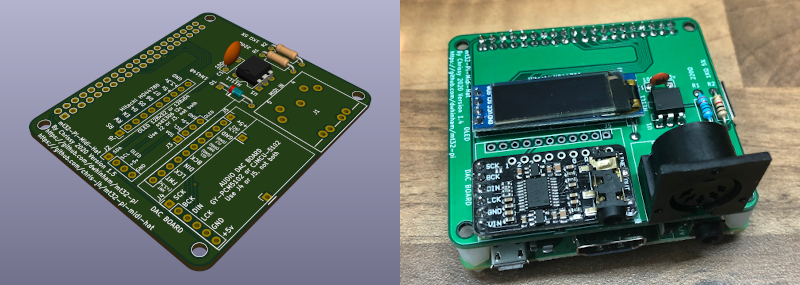
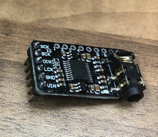
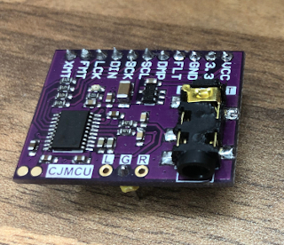
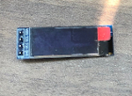
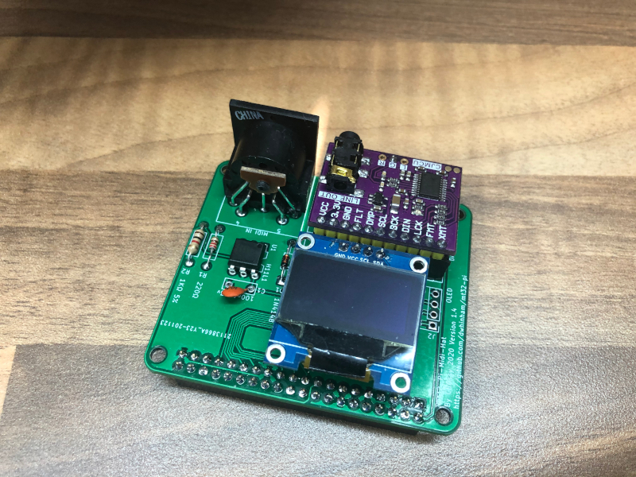
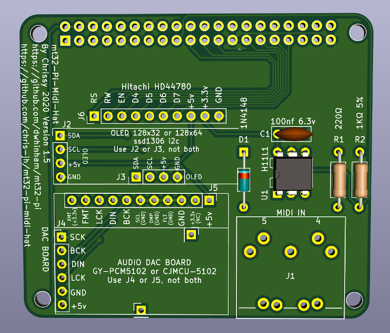

# mt32-pi-midi-hat
A Raspberry Pi Midi Hat for the project mt32-pi by Dale Whinham (https://github.com/dwhinham/mt32-pi).

This PCB is designed from the schematic available from the above project.

Version 1.5 Copyright 2020 Chrissy

## Audio DAC's

I designed this Hat to accommodate 2 different PCM5102 DAC boards that are available from Amazon or eBay.

***GY-PCM5102***

***CJMCU-5102***

Currently the GY-PCM5102 version seems to be the most popular on Amazon and eBay, just search for PCM5102.

## Screen's

**SSD1306 OLED**

The Hat can take either the 128x32 SSD1306 OLED, or the 128x64 SSD1306 OLED

***SSD1306 OLED 128x32***

***SSD1306 OLED 128x64***

Again both screens are available from Amazon or eBay.

The 128x64 OLED connects on the board at this position here.

You will need to put some none conductive material under the OLED, so it does not short agains the Pins of the Raspberry Pi.

***Hitachi HD44780***

There are two versions of this screen, one that communicates via the i2c (like the above OLEDS) or a direct connection which is currently untested on my PCB.

To use the i2c version you will need to connect the screen to one of the OLED connections J2 or J3 on the PCB.

The Hitachi screen can also come in different sizes, ideally you want one that is 24 characters in length and either 2 or 4 lines.

 

### Configuration

Please see the main mt32-pi Project (https://github.com/dwhinham/mt32-pi) on how to configure and use your screen and DAC.

### BOM

| Reference | Value | Quantity | URL |
|-----------|-------|----------|-----|
| C1        | 100nf | 1        | https://www.mouser.co.uk/ProductDetail/Murata-Electronics/RCER71E104K0K1H03B?qs=Ey7%2FXF42M3ci4g3t0g7SIw%3D%3D |
| R1        | 220Ω | 1        | https://www.mouser.co.uk/ProductDetail/Vishay-Beyschlag/MBB02070C2200FCT00?qs=PwR17mNzlcOWyOoLtTQfsw%3D%3D |
| R2        | 1KΩ 5% | 1        | https://www.mouser.co.uk/ProductDetail/Vishay-Dale/CCF071K00JKE36?qs=NQWA6AwZmkMdaaeOGvuguw%3D%3D |
| D1        | 1N4148 | 1        | https://www.mouser.co.uk/ProductDetail/ON-Semiconductor-Fairchild/1N4148?qs=i4Fj9T%2FoRm8RMUhj5DeFQg%3D%3D    |
| U1        | H11L1 | 1        | https://www.mouser.co.uk/ProductDetail/ON-Semiconductor-Fairchild/H11L1M?qs=P36CEcFBmYxn5ViwkIckpw%3D%3D |
| J1        | DIN-5 | 1        | https://www.mouser.co.uk/ProductDetail/490-SDS-50J |
| J2 or J3    | SSD1306 OLED | 1        | Amazon or eBay |
| J4 or J6    | DAC GY-PCM5102 or CJMCU-5102  | 1        | Amazon or eBay |
| J5        | Hitachi HD44780 | 1        | Amazon or eBay |

[**THT Interactive BOM**][IBOMTHT1_5]

[IBOMTHT1_5]: http://htmlpreview.github.io/?https://raw.githubusercontent.com/chris-jh/mt32-pi-midi-hat/master/bom/mt32-pi-midi-hat_bom_v1_5.html.html
